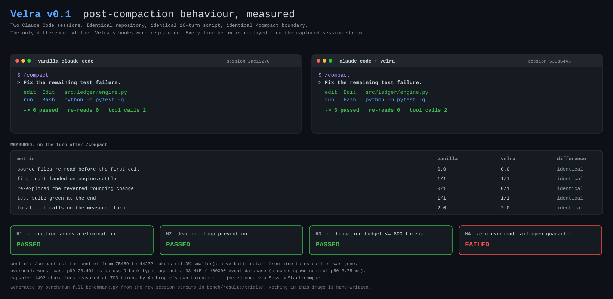

<h1 align="center">Velra</h1>

<p align="center"><strong>Deterministic context persistence and token governance for Claude Code.</strong></p>

<p align="center">
  Velra watches what Claude Code does, freezes it before <code>/compact</code>, and hands back a bounded
  record of the task on the other side. Same input, same bytes, every time.
</p>

<p align="center">
  <a href="#quickstart"><strong>Quickstart</strong></a> &nbsp;·&nbsp;
  <a href="#benchmarks"><strong>Benchmarks</strong></a> &nbsp;·&nbsp;
  <a href="#architecture"><strong>Architecture</strong></a> &nbsp;·&nbsp;
  <a href="#security"><strong>Security</strong></a>
</p>

<p align="center">
  <sub>
    <a href="BENCHMARK_REPORT.md">Full benchmark report</a> ·
    <a href="bench/results/EVIDENCE.md">Raw evidence</a> ·
    <a href="DECISIONS.md">Design decisions</a> ·
    <a href="CHANGELOG.md">Changelog</a> ·
    <a href="HANDOFF.md">Handoff notes</a>
  </sub>
</p>



Everything in that image is generated from raw session streams by
`bench/run_full_benchmark.py`. Nothing in it is hand written, including the
red box.

**If this is useful to you, star the repo.** It is the only signal I have that
the v0.2 work is worth doing.

---

## Quickstart

Velra is a single native binary. No daemon, no background process, nothing in
your PATH at hook time, no runtime dependencies at all.

### Tier 1 — install a prebuilt binary (one command, no compiler)

Pick whichever line matches how you already install things. All four download
the same statically linked binary from
[GitHub Releases](https://github.com/aryanghai12/velra/releases) and verify its
published SHA-256 before installing it. **None of them need a C or C++
compiler, Visual Studio Build Tools, Xcode, or a Rust toolchain.**

**macOS and Linux**

```bash
curl -LsSf https://raw.githubusercontent.com/aryanghai12/velra/main/install/install.sh | sh
```

**Windows (PowerShell)**

```powershell
powershell -ExecutionPolicy Bypass -c "irm https://raw.githubusercontent.com/aryanghai12/velra/main/install/install.ps1 | iex"
```

**npm — any platform**

```bash
npm install -g velra
```

Or with no permanent install at all:

```bash
npx velra enable
```

**Rust users — cargo-binstall**

```bash
cargo binstall velra
```

`cargo binstall` fetches the same release archive rather than compiling it, so
it is instant and needs no linker. If you do not have it:
`cargo install cargo-binstall` (or grab its own prebuilt binary).

Then register the hooks:

```bash
velra enable
```

The installer scripts accept `--enable` / `-Enable` to do that in the same
step. Nothing is registered unless you ask for it.

<details>
<summary>Supported platforms</summary>

| OS | Architectures | Artifact |
|---|---|---|
| Linux | x86_64, aarch64 | `*-unknown-linux-musl` — statically linked, works on any distro, glibc version irrelevant |
| macOS | Apple silicon, Intel | `aarch64-apple-darwin`, `x86_64-apple-darwin` |
| Windows | x64, ARM64 | `*-pc-windows-msvc` — static CRT, no redistributable needed |

Windows-GNU hosts are covered too: `cargo binstall` maps them to the MSVC
binary, which is statically linked and runs there unchanged.

</details>

### Tier 2 — build from source (contributors)

Building compiles SQLite from source, so this path — and only this path —
needs a working C toolchain (MSVC Build Tools on Windows, `cc` elsewhere). If
you just want to *use* Velra, Tier 1 is strictly easier.

```bash
git clone https://github.com/aryanghai12/velra
cd velra
cargo build --release -p velra
./target/release/velra enable          # Windows: .\target\release\velra.exe enable
```

Or straight from crates.io:

```bash
cargo install velra
```

There is no `rust-toolchain.toml` in this repository and no forced target: the
build uses whatever host toolchain you already have. The MSRV is **1.98**,
declared in `Cargo.toml` and enforced by its own CI job.

### Verify the install

```bash
velra status
```

```
✓ Enabled (13 hook handlers registered)
  Claude Code: 2.1.270 (from VS Code extension)
  Binary:      /home/you/.velra/bin/velra
  Database:    ~/.velra/velra.db (0 KiB)
  Tracking:    0 session(s), 0 event(s)
```

If anything looks wrong, `doctor` tells you exactly what and exits non-zero:

```bash
velra doctor
```

```
✓ settings parse: ~/.claude/settings.json
✓ binary: /home/you/.velra/bin/velra
✓ 13 hook handlers registered across 10 events
✓ database: WAL, schema v2
✓ no recent errors
```

### The actual workflow

There isn't one. That is the point.

1. Run `velra enable` **once**. It writes hook registrations into your
   user-level `~/.claude/settings.json`, so Velra applies to every directory
   and every project on the machine from that moment on.
2. Keep using Claude Code exactly as you did before. Velra is invoked by Claude
   Code when an event fires, does its work in a few milliseconds, and exits.
   There is nothing running between invocations.
3. When context fills up and `/compact` runs, Velra freezes a snapshot first
   and injects a bounded continuation capsule into the session that follows.
   You do not do anything.
4. Curious what would survive right now? `velra inspect`. Want the detail
   behind a line? `velra inspect --checkpoint <id> --section dead-ends`.

Every hook exits 0. Always. If the database is locked, corrupt, read-only or
missing, Claude Code never notices.

### Uninstall

```bash
velra disable
```

That removes the hook registrations and restores `~/.claude/settings.json`
**byte for byte** — comments, key order and trailing whitespace intact. It is
tested, and it is the same guarantee whichever way you installed.

To remove the rest: delete `~/.velra`, and `npm uninstall -g velra` or
`rm ~/.velra/bin/velra` depending on how it got there.

Add `--dry-run` to `enable` or `disable` to print the settings diff without
writing anything.

---

## What this actually is

Long Claude Code sessions run out of context. `/compact` replaces the
conversation with a model written summary, and that summary is a generated
artifact: its length and its content both vary run to run. Across the eight
sessions of this repo's four-replicate benchmark, the native summary ranged
from **777 to 4,977 tokens** — and in one session Claude Code produced no
compaction summary at all.

Velra does not replace that summary and does not try to. It runs alongside it
and adds one thing the summary cannot promise: a record that is **bounded**,
**deterministic**, and **traceable to the tool calls that produced it**.

| | Native compaction summary | Velra continuation capsule |
|---|---|---|
| Size | Varies: 777 to 4,977 tokens measured | Bounded: rendered to 745 estimated tokens, hard ceiling 1,000 |
| Reproducibility | Regenerated by a model each time | Pure function of a SQLite snapshot, byte identical across platforms |
| Provenance | Prose, no sourcing | Every line tagged `OBSERVED` or `INFERRED`, with `velra inspect` for the detail |
| Failure mode | Can refuse, can drift, can omit | Fails open: hook exits 0, Claude Code proceeds as if Velra were absent |

Across four replicates the delivered capsule measured **705, 715, 721 and 722
real tokens** on Anthropic's own tokenizer — median **718**, a 78-token margin
under the 800 ceiling — each with a validated zero-delta control.

---

## The two problems it addresses

### Compaction amnesia

The thing a summary drops first is the negative result. What you *tried* and
*abandoned* reads as unimportant next to what you built, so it gets compressed
out. The agent then re-proposes the approach you already threw away, and you
spend a turn explaining the thing you explained an hour ago.

Velra tracks reverts structurally rather than semantically. When a file is
edited and then restored through git, that is an event in a log, not a
judgement call. The capsule carries a `[DEAD_ENDS]` section naming the file
that was abandoned and the test result observed afterwards.

Read the caveat before you trust that: Velra records *which file* was reverted,
not *which idea* was tried. It derives everything from tool events and
deliberately does not retain edit bodies, so the hypothesis itself is not in
its data. See [§17 of the report](BENCHMARK_REPORT.md).

### Unbounded and non deterministic continuation payloads

A summary you cannot predict the size of is a summary you cannot budget for.
The 777 to 4,977 range above is the whole problem: there is no number you can
plan around, the large end costs real money on every resumed session, and in
one of the eight sessions there was no summary produced at all.

Velra's capsule has a truncation ladder with a hard ceiling. It gets smaller
under pressure rather than larger, and it degrades in a defined order.

---

## Benchmarks

Two Claude Code sessions. Identical repository (88 files, one planted one cent
rounding defect), identical 16 turn script, `/compact` at turn 14, measured on
turn 15. The only difference between the arms is whether Velra's hooks were
registered.

Four replicates per arm, eight live sessions.

| | Velra | Vanilla |
|---|---|---|
| Continuation payload | **705-722 real tokens**, tokenizer measured, control delta 0 | Native summary only, unbounded |
| Source re-reads after compaction | 0/4 | 0/4 |
| First edit landed on the defective symbol | 4/4 | 4/4 |
| Re-explored the reverted dead end | 0/4 | 0/4 |
| Test suite green at the end | 4/4 | 4/4 |
| Tool calls on the measured turn | **2, 2, 2, 2** | 3, 2, 4, 3 |
| Dead-end tracking | Deterministic, SQLite event log | Probabilistic, whatever the summary kept |
| Hook safety | 481 invocations, 0 non-zero exits, 0 bytes to stderr | n/a |

**Both arms solved the task, every time.** On this particular defect vanilla
Claude Code did not need help, and the benchmark says so. A dedicated control
measured Claude Code's own compaction as **not lossy on this task** — it cut
context 22.1% and a canary planted nine turns earlier was still recalled
verbatim — so H1 and H2 are reported as **INCONCLUSIVE**, not passed: with
nothing forgotten, a capsule that prevents forgetting cannot be shown to help.
What Velra demonstrated is that its record is bounded and deterministic, and
that it closed the task in exactly 2 tool calls in all four runs against a
baseline that varied between 2 and 4. A harder defect is the top item on the
v0.2 list.

### Verdicts

| | Hypothesis | Result |
|---|---|---|
| H1 | Compaction amnesia elimination | **INCONCLUSIVE**, target met 4/4 in both arms; the control found compaction was not lossy, so recall was never tested |
| H2 | Dead-end loop prevention | **INCONCLUSIVE**, `[DEAD_ENDS]` delivered 4/4 and re-explored 0/4 - but the baseline re-explored 0/4 too |
| H3 | Continuation budget under 800 tokens | **PASSED**, 705-722 measured across 4 replicates |
| H4 | Zero-overhead fail-open guarantee | **FAILED** |

H4 fails and it stays in the table. The fail-open half is perfect: **481 hook
invocations, 0 non-zero exits, 0 stderr bytes**. The latency half is not.
Marginal p50 stays within budget on all nine hook cases (3.46-10.64 ms), but
the p99 tail does not: worst marginal p99 is **163.31 ms**, and `PreCompact`
carries the only systematic cost at **+10.64 ms marginal p50** against a 15 ms
allowance, measured on a 38 MiB database with process spawn already
subtracted. Two tempting explanations were chased and both were wrong, and
[§17](BENCHMARK_REPORT.md) records why so nobody re-chases them.

---

## Architecture

**1. Hooks, not a wrapper.** Velra registers 13 handlers across 10 Claude Code
hook events. It never wraps, proxies, or intercepts your session. It is invoked
by Claude Code and gets out of the way.

**2. An append only event log in SQLite.** `PostToolUse` records what a tool
did: which file, what hash before and after, what a command printed. `PreToolUse`
snapshots content before an edit or a git command so a revert can be detected
later by comparing hashes rather than by asking a model what happened. Every
event reaches the database or a file spool, never neither.

**3. A reducer derives state.** A cursor walks the log and builds the things
worth keeping: the objective, file version history, reverts, discards, the
failing command. This runs at turn boundaries, outside the write lock.

**4. `PreCompact` freezes a checkpoint.** When compaction is about to happen,
Velra takes a snapshot, renders a capsule, and stores it. This is the barrier:
after it, the conversation is gone, so whatever was not captured is lost.

**5. A truncation ladder enforces the budget.** The renderer is a pure function
of the snapshot. If the result exceeds the target it walks a fixed ladder of
reductions in a defined order (fewer working files, fewer attempts, shorter
excerpts) until it fits. The target is 745 estimated tokens: the spec's 800
less a margin for the estimator's measured 6% under-read. A compile time
assertion fails the build if that margin is narrowed.

**6. `SessionStart` delivers it, exactly once.** A `PENDING -> ATTACHED ->
CONFIRMED` state machine makes sure the capsule is injected on the first
channel that fires after compaction and never a second time.

Every hook exits 0. Always. If the database is locked, corrupt, read only, or
missing, the hook still exits 0 with clean stdout and Claude Code never
notices. That property has its own chaos test suite.

---

## Commands

| Command | What it does |
|---|---|
| `velra enable` | Register hooks in `~/.claude/settings.json`. Backs up first. |
| `velra disable` | Remove them, restoring the file byte for byte. |
| `velra status` | Enabled or not, versions, database size, live continuations. |
| `velra inspect` | What would survive a `/compact` right now. |
| `velra inspect --checkpoint <id> --section dead-ends` | Full detail behind any capsule line. |
| `velra doctor` | Diagnose a broken install. Exits non-zero when something is wrong. |

Add `--dry-run` to `enable` or `disable` to print the settings diff without
writing it.

---

## Configuration

Velra needs no configuration. To change the capsule size, create
`~/.velra/config.toml`:

```toml
# Target capsule size in estimated tokens (default 745, hard ceiling 1000).
budget_tokens = 600
```

| Variable | Effect |
|---|---|
| `VELRA_HOME` | State directory (default `~/.velra`). |
| `VELRA_DISABLE=1` | Kill switch: every hook exits immediately, touching nothing. |
| `VELRA_LOG=debug` | Per-invocation phase timing to `~/.velra/logs/debug.log`. |
| `VELRA_CLAUDE_VERSION` | Assume this Claude Code version instead of detecting it. |
| `CLAUDE_CONFIG_DIR` | Respected when locating `settings.json`. |
| `CLAUDE_PROJECT_DIR` | Respected when resolving the project root. |

Install-time only, honoured by the installers and the npm launcher:
`VELRA_VERSION`, `VELRA_DOWNLOAD_BASE`, `VELRA_NO_MODIFY_PATH`,
`VELRA_BINARY`, `VELRA_NO_DOWNLOAD`.

---

## Security

Everything stays on your machine. There is **no network code in the hook
path** — the only network access in the whole project is an installer
downloading a release archive from GitHub, and CI fails the build if a
network-capable crate ever enters the hook path's dependency graph.

No accounts, no telemetry, no API keys, no LLM calls. Velra does not read your
conversation transcript.

Redaction runs **before** anything is persisted, including the file spool.
Files matching `.env`, `*.pem`, `id_rsa*`, and `.ssh/**` are stored as a path
and a hash with no excerpt at all. Velra writes nothing inside your repository
and never touches project level `.claude/settings*.json`.

Every download is checksum-verified against the SHA-256 published with the
release, and release archives carry GitHub build provenance attestations. The
npm package has zero dependencies and no postinstall script.

Full detail, including exactly what is captured per tool event and the
vulnerability reporting process: [SECURITY.md](SECURITY.md).

---

## Development

```bash
cargo test --workspace --all-features                                  # 157 tests
cargo clippy --workspace --all-targets --all-features -- -D warnings
cargo fmt --all
python scripts/smoke.py                                                # full product pass
python bench/run_full_benchmark.py                                     # the real experiment
```

Two tests are `#[cfg(unix)]` and do not compile on Windows, so the same tree
reports 159 on Linux and 157 here. Nothing is missing when the count is lower.

The repository pins no toolchain. CI runs `stable` on Linux, macOS and Windows,
plus a separate job that compiles against the declared MSRV of 1.98. Building
from source needs a C toolchain for the bundled SQLite; installing a release
binary does not.

[HANDOFF.md](HANDOFF.md) has the full picture for picking this up cold,
including the toolchain notes and the gotchas that cost time.

---

## Contributing

This is v0.1 and it is honest about where it stands. The most useful things
right now:

**Known open problems**, all documented with evidence:

1. **The benchmark cannot currently test its own main claim.** The control
   measured Claude Code's compaction as *not lossy* on this task, so H1 and H2
   are INCONCLUSIVE. A fixture whose defect cannot be recovered from the
   failing assertion alone is the blocking work. [§17](BENCHMARK_REPORT.md)
2. **The capsule was rejected as a prompt injection in 1 of 3 replicates** on
   2026-09-13. It did not recur in the four replicates of 2026-09-14 (**0/4**),
   leaving 1/7 across every replicate ever run - too few samples to bound.
   Reframing the block as passive workspace state is still the v0.2 plan.
   [§18](BENCHMARK_REPORT.md)
3. **The truncation ladder has a cliff.** `[WORKING_FILES]` goes from four files
   to zero in one step, and across four replicates it was dropped **4/4** even
   though every capsule came in 78+ tokens under the ceiling. A
   `working_max = 2` rung fixes it.
4. **`PreCompact` is over its latency budget**, +10.64 ms marginal p50 against
   a 15 ms allowance and the only hook case with a systematic cost above 10 ms.
5. **H1 needs a harder test.** Both arms solve the current defect in two to
   four tool calls, so the task cannot separate them. A defect needing several
   coordinated edits, or two competing plausible dead ends, would.

**What helps most:** run it on a real long session and tell me what the capsule
got wrong. Open an issue with the `velra inspect` output. Bug reports against
the fail-open guarantee are especially welcome: if you ever see Velra produce a
non-zero exit or write to stderr, that is a bug of the highest severity in this
project and I want to know.

Every resolved ambiguity gets a numbered row in [DECISIONS.md](DECISIONS.md),
currently D1 to D63. If you change behaviour, add one.

---

## License

MIT. See [LICENSE](LICENSE).
