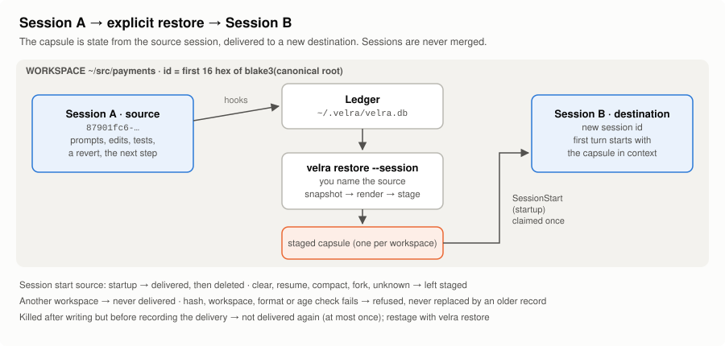

# Architecture

Velra is a local recorder and renderer that sits beside a coding agent. It
watches what a Claude Code session *does* through hooks: prompts, tool
calls, edits, commands, test results and reverts. It reduces those events
to a small operational state, renders that state within a fixed budget,
and hands the rendering to a later context. The later context is either the
same session after `/compact`, or a brand-new session you choose to
continue in with `velra restore`.

Velra never replays the conversation, never calls a model and never uses
the network at runtime. Everything below happens in one native binary and
one SQLite database on your machine.

- [The pipeline](#the-pipeline)
- [Components](#components)
- [Capture](#capture)
- [Storage: ledger and spool](#storage-ledger-and-spool)
- [Event order](#event-order)
- [Reduction](#reduction)
- [Snapshot selection](#snapshot-selection)
- [Rendering](#rendering)
- [Workspaces and sessions](#workspaces-and-sessions)
- [Delivery paths](#delivery-paths)
- [Fail-open hooks](#fail-open-hooks)
- [Redaction](#redaction)
- [Replay and idempotence](#replay-and-idempotence)
- [Where to read the code](#where-to-read-the-code)

---

## The pipeline


```
source session (Claude Code)
  → event capture            velra hook <event>: normalise, redact, cap
  → durable ledger / spool   SQLite events table (WAL); spool/ when the DB is busy
  → causal reduction         reducer: events in logical order → task-state tables
  → snapshot                 snapshot::build: what a capsule may contain
  → bounded rendering        render::render: pure, deterministic, budgeted
  → staged capsule           velra restore: $VELRA_HOME/staged/<workspace_id>/capsule.<gen>.json
  → explicit restore         a person names the source session
  → claim                    exclusive creation of capsule.<gen>.claimed
  → SessionStart delivery    hookSpecificOutput.additionalContext, source "startup" only
  → destination session      a new session id; it inherits the capsule text and nothing else
```

The same snapshot and renderer also serve the in-session path: at
`PreCompact` Velra freezes a checkpoint, and after compaction it delivers
that checkpoint back into the same session. That path never crosses a
session boundary ([Delivery paths](#delivery-paths)).

## Components

Two crates. `velra-core` holds the logic and never talks to Claude Code;
`velra` is the binary that does.

| Path | Responsibility |
|---|---|
| `crates/velra/src/main.rs` | Dispatches `velra hook <event>` and `velra reduce` straight from `argv`, before clap, logging or any global setup. Everything else goes to the CLI. |
| `crates/velra/src/hook.rs` | The hook runtime: read stdin, normalise, redact, append, deliver. Watchdog, panic containment, one JSON object on stdout at most. |
| `crates/velra/src/normalize.rs` | Claude Code hook input to a normalised, redacted payload, with per-field size caps. |
| `crates/velra/src/cli.rs` | `enable`, `disable`, `status`, `inspect`, `doctor`, `restore`. The hook path never reaches it. |
| `crates/velra/src/restore.rs` | `velra restore`: session discovery (ledger and transcripts) and the picker. |
| `crates/velra/src/inspect.rs` | Previews, section detail, `--trace` output. |
| `crates/velra/src/settings.rs` | Comment-preserving edits to Claude Code's `settings.json`; the hook registration table. |
| `crates/velra/src/compat.rs` | Claude Code version detection and feature gates. |
| `crates/velra/src/home.rs`, `log.rs`, `atomic.rs` | `$VELRA_HOME` layout and `config.toml`; logs; atomic file replacement. |
| `crates/velra-core/src/db.rs` | SQLite schema (v3), forward-only migrations, connection roles and lock budgets, corrupt-database rotation. |
| `crates/velra-core/src/eventlog.rs`, `spool.rs`, `event.rs` | Appending events; the no-loss spool; the event row and its dedupe key. |
| `crates/velra-core/src/order.rs` | Logical event order within a session. |
| `crates/velra-core/src/reducer.rs` | Cursor-based reduction of events into task-state tables; session epochs. |
| `crates/velra-core/src/intent.rs`, `prompt.rs`, `material.rs`, `constraint.rs` | What the user asked for: which part of a prompt the user wrote, pasted material, the objective and later directives, constraints and rejected approaches. |
| `crates/velra-core/src/commands.rs`, `testids.rs`, `revert.rs`, `shell.rs`, `git.rs` | What happened: command outcomes, exact test ids, reverts by content hash, shell parsing, git metadata without spawning `git`. |
| `crates/velra-core/src/snapshot.rs` | Selects what a capsule may contain. |
| `crates/velra-core/src/render.rs` | The pure renderer and the truncation ladder. |
| `crates/velra-core/src/checkpoint.rs`, `continuation.rs` | The in-session path: frozen checkpoints and the delivery state machine. |
| `crates/velra-core/src/restore.rs`, `staging.rs` | The cross-session path: build, stage, claim. |
| `crates/velra-core/src/workspace.rs` | The single definition of workspace identity. |
| `crates/velra-core/src/transcript.rs` | Tolerant reading of Claude Code transcript headers, for picker labels only. |
| `crates/velra-core/src/provenance.rs` | `velra inspect --trace`: presence per layer and the first loss. |
| `crates/velra-core/src/redact.rs`, `paths.rs`, `hash.rs`, `text.rs`, `time.rs` | Redaction, path identity and sensitive paths, blake3 hashing, token estimation, time formatting. |

## Capture

`velra enable` registers 13 handlers across 10 hook events in your
user-level Claude Code settings ([Configuration](CONFIGURATION.md#hook-registration)).
Each invocation:

1. reads the hook JSON from stdin;
2. normalises it into one event (`normalize.rs`): prompt text, tool name and
   input, file paths and content hashes, command line, the tail of its
   output, the outcome;
3. redacts every string **before** anything is persisted, spool included;
4. caps each field: prompts 4 KiB, commands 2 KiB, command output 8 KiB
   (the tail), errors 4 KiB, a whole event 16 KiB. Constraints and rejected
   approaches are extracted from the full prompt before it is capped (D79);
5. appends the event, or spools it if the database is busy.

Edits are hashed before (`PreToolUse`) and after (`PostToolUse`). A later
`git restore`, `git checkout --` or inverse edit is recognised by comparing
content hashes, not by interpreting text.

Two hook inputs carry text written by the model rather than the user:
prompts may arrive with context a client injected around them, and
`PostCompact` carries Claude Code's own compaction summary. Injected context
is stripped before a prompt is interpreted (D70). The compaction summary is
stored, redacted and capped at 32 KiB, for diagnostics; no capsule is ever
built from it.

## Storage: ledger and spool

Everything lives under `$VELRA_HOME` (default `~/.velra`). The database,
`velra.db`, is SQLite in WAL mode at schema v3:

| Tables | Contents |
|---|---|
| `events` | the append-only log of redacted hook events |
| `projects`, `sessions` | workspaces and their sessions, with each session's current epoch |
| `intents`, `constraints` | the objective and later directives; constraints and rejections quoted verbatim |
| `commands`, `edits`, `file_versions`, `file_stats`, `dead_ends` | what ran and its result; what changed; content hashes; reverts |
| `checkpoints`, `compactions`, `continuations`, `injections` | the in-session `/compact` path |
| `reducer_cursor`, `meta` | reducer position and schema metadata |

Each connection has a role with its own lock budget: 100 ms for hooks that
append or deliver, 50 ms at `PreCompact`, 1 s for the reducer, 5 s for the
CLI (`db::Role`). Velra's own busy handler enforces those budgets against
the clock (D133, D146).

**The spool** (`spool.rs`) is the no-loss fallback. When a hook cannot get
the database within its budget, it writes its event to `spool/` as one file
(temp file, fsync, rename). The next reducer pass or CLI command ingests
spooled files idempotently. A file that is not an event goes to
`spool/bad/` and is never ingested.

**Corruption.** A database SQLite reports as corrupt is moved aside to
`velra.db.corrupt-<ts>` and recreated, by one process at a time under an OS
lock on `velra.db.rotate-lock`, and only if it is still corrupt once that
lock is held. On POSIX each open also checks that the path still names the
file it opened, because SQLite finds a database's `-wal` by name (D137).

A staged capsule is **not** in the database. It is a file, so delivery at
session start works even when the database is locked.

## Event order

An event row has two orderings, and neither is chronology on its own
(`order.rs`). `id` is ingestion order; `ts_ms` is the hook's wall clock. A
directly appended event keeps its `id` order, and its clock is never used
to reorder it, so a clock that runs backwards cannot reverse two things the
ledger saw happen in sequence. A spooled event is marked as spooled and
placed after the last direct event that was ingested before it and whose
clock is not later than its own.

Every event has a dedupe key. For a tool event it is derived from the hook
event, session and `tool_use_id`, so one tool call observed by two
registered copies of the hook is stored once. Events without a
`tool_use_id` keep the clock in their key (D148; limits in
[Guarantees](GUARANTEES.md#known-limitations)).

## Reduction

The reducer (`reducer.rs`) folds a session's events, in logical order, into
the task-state tables. Each batch is one `BEGIN IMMEDIATE` transaction that
reads the cursor, applies events, advances the cursor and commits, so
concurrent reducers are safe and a crash mid-batch rolls back.

When a spooled event turns out to belong earlier than events already
applied, the session is rebuilt: its projection rows are cleared and every
event is applied again in logical order. Projections are derived state, so
a rebuild changes only their order.

The reducer runs asynchronously after `Stop` and `PostToolBatch`, in a
bounded pass inside `PreCompact`, and in full before `velra inspect` and
`velra restore`. Applying an event reads nothing but the ledger. Anything
that depends on the disk (a turn-end file scan, which paths a failing
command's output names) is observed by the hook when the event happens and
stored in the event.

**Epochs.** `SessionStart(clear)` starts a new epoch of the same session.
Snapshots read the current epoch, so `/clear` empties what a later restore
or compaction would render without deleting the recorded events.

## Snapshot selection

`snapshot::build` decides what a capsule may contain, from the current
epoch of one session:

- the first prompt, the latest one, and the most recent earlier prompt that
  names code when the latest names none (D64);
- constraints and rejected approaches the user stated, quoted verbatim;
- per-test status by exact test id, from the latest run that covered each
  test;
- the latest test result and failure location;
- reverted edits, with every reverted file getting a slot before any file
  gets a second (D73);
- recent edits and file activity, with files outside the workspace ranked
  last (D66).

## Rendering

`render::render` is a pure function of the snapshot and the budget. The
output is plain text inside a `<VELRA_WORKSPACE_STATE>` element. Every
section is marked `OBSERVED` (read from a tool event or a prompt) or
`INFERRED` (derived from observed rows).

| Constant | Value |
|---|---|
| `DEFAULT_BUDGET_TOKENS` | 740 estimated tokens (configurable with `budget_tokens`) |
| `MIN_BUDGET_TOKENS` | 64 |
| `HARD_CEILING_TOKENS` | 1,000 |
| `ABSOLUTE_MAX_CHARS` | 9,500 |

When the text exceeds the target, a fixed ladder of named reductions runs
in order (D71). Regenerable or redundant detail goes first; the objective
is shortened only after every such rung; exact identifiers are kept
longest. If the ladder is not enough, a hard stop removes whole lines by
retention class (D72). The rungs are named, so `velra inspect --trace` can
say which one removed a line.

A capsule rendered for `velra restore` says it is another session's record
and names that session (D147). A continuation after `/compact` says it is
this session's own. The framing of a restore costs no more tokens than a
continuation's, because it competes with content for the same budget.

## Workspaces and sessions



```
WORKSPACE        durable ownership boundary; id = 16 hex of blake3(canonical root)
├── SESSION A    events, projections, checkpoints   ← a source session, first-class
├── SESSION B    …
└── staged capsule   at most one live record, only from an explicit `velra restore`
```

**Workspace resolution** is one function, `velra_core::workspace::resolve`,
used by the hooks and the CLI:

```
root := $CLAUDE_PROJECT_DIR, else the first ancestor of cwd holding .git, else cwd
id   := blake3(canonical, normalised root)[0..16 hex]
```

Canonicalisation makes different spellings of one directory (symlinks, case
on Windows, separators, 8.3 short names) one workspace. `velra restore` run
inside a repository also looks for the nearest directory, from the current
one up to the repository root, that Velra has recorded a session in,
because Claude Code started in a monorepo package records that package as
the workspace.

**Sessions** are Claude Code's session ids. They are never merged. A source
session stays a first-class identity; its id is written into the staged
record and named by the capsule and by the delivery message. The
destination session keeps its own id and inherits only the capsule text.

## Delivery paths

| | In-session continuation | Cross-session restore |
|---|---|---|
| Trigger | `/compact`, manual or automatic | you run `velra restore` |
| Source | the same session | a session you name |
| Built from | a checkpoint frozen at `PreCompact` | the source session's current epoch, rendered when you run the command |
| Stored in | the database (`checkpoints`, `continuations`) | `staged/<workspace_id>/capsule.<gen>.json` |
| Delivered on | `SessionStart(compact\|resume)`, else the first `UserPromptSubmit` or `PostToolUse` after the compaction | `SessionStart(startup)` only |
| At most once by | a unique delivery key and conditional state updates | exclusive creation of a claim file that nothing takes over |
| Expires | 7 days | 7 days after staging |
| Crosses sessions | never | only this way |

A staged record carries its own eligibility (`intent: "new_session"`,
`deliver_on: ["startup"]`). The claim logic tests the incoming source for
membership in that list and contains no source names. A source this build
does not know is refused.

What "at most once" means when a process is killed mid-delivery is spelled
out in [Guarantees → Delivery semantics](GUARANTEES.md#delivery-semantics-precisely).

## Fail-open hooks

Velra must never be the reason a Claude Code session fails.

- `velra hook` and `velra reduce` run before clap, logging or any global
  initialisation.
- The process always exits 0. Panics are caught; the release profile keeps
  `panic = "unwind"` for that reason.
- Nothing is written to stderr. Stdout is empty or exactly one JSON object,
  guarded by a once-lock so a watchdog cannot interleave a partial write.
- A watchdog ends a synchronous hook after 250 ms and the async reducer
  after 1 s. An event already built is spooled rather than lost; a deadline
  earlier than that (while stdin is being read) is logged to
  `logs/errors.log` (D145).
- `VELRA_DISABLE=1` or the file `~/.velra/disabled` makes every hook return
  immediately without touching the database.

`crates/velra/tests/fail_open.rs` and the `fault-injection` feature
(`VELRA_TEST_*` seams, compiled only into test builds) exercise panics,
stalls, kills and broken databases against the real binary.

## Redaction

`redact.rs` runs an Aho–Corasick literal prefilter and then per-kind
patterns over every string before it is stored. Matches become
`[REDACTED:<kind>]`. Sensitive paths (`paths.rs`) are stored as path and
hash only. A staged capsule is redacted again before it is written. The
detector list and the residual risks are in [SECURITY.md](../SECURITY.md).

## Replay and idempotence

- Rendering is deterministic for a fixed ledger and clock
  (`render_fidelity::identical_input_renders_identically`).
- Replaying a session's recorded events into a fresh database rebuilds the
  same capsule (`lifecycle::replaying_the_recorded_events_rebuilds_the_same_capsule`).
- Spool ingestion is idempotent on either side of its commit
  (`storage_faults::spool_replay_interrupted_on_either_side_of_its_commit_is_idempotent`).
- An interrupted reduction leaves no partial state
  (`storage_faults::a_reduction_interrupted_before_its_commit_leaves_no_partial_state`).
- The frozen source ledgers of the v0.1.2 live benchmark replay through the
  final build with every declared marker delivered
  ([Benchmark](BENCHMARK.md#2-final-build-replay-of-the-frozen-source-ledgers)).

## Where to read the code

| To understand | Start at |
|---|---|
| a hook invocation end to end | `crates/velra/src/hook.rs` → `run` |
| what a capsule contains and why | `crates/velra-core/src/snapshot.rs`, `render.rs` |
| restore | `crates/velra/src/cli.rs` → `cmd_restore`, `crates/velra-core/src/restore.rs`, `staging.rs` |
| delivery at session start | `crates/velra/src/hook.rs` → `session_start`, `deliver_staged` |
| event order and replay | `crates/velra-core/src/order.rs`, `reducer.rs` |
| workspace identity | `crates/velra-core/src/workspace.rs` |
| `--trace` | `crates/velra-core/src/provenance.rs` |
| every design decision | [DECISIONS.md](../DECISIONS.md) (D1–D150) |

---

[← README](../README.md) · [Restore](RESTORE.md) · [Guarantees](GUARANTEES.md) · [Configuration](CONFIGURATION.md) · [Benchmark](BENCHMARK.md)
