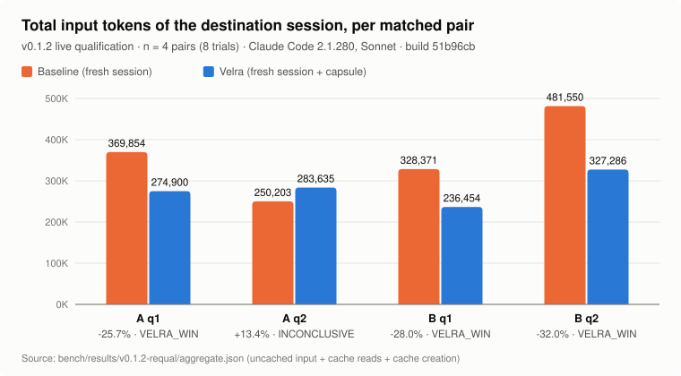
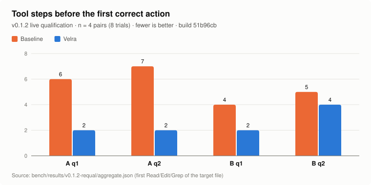
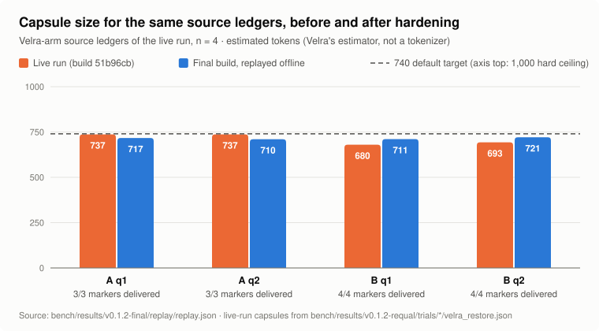
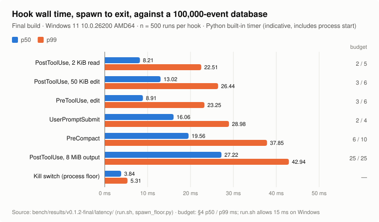

# Velra v0.1.2 benchmark report

This is the current benchmark reference for Velra 0.1.2. It measures Velra
as a **cross-session continuation system**: a developer leaves a large
Claude Code session, starts a brand-new one, and Velra carries a bounded
operational state across that boundary. `/clear` appears as one of the two
transitions tested, not as the subject.

The report keeps three kinds of evidence apart, because they establish
different things and were produced by different builds:

| Evidence | Build | Produced | Establishes |
|---|---|---|---|
| **[1. Live qualification](#1-live-qualification-the-token-burn-requalification)** | `51b96cb` | 2026-09-23, 16 real Claude Code sessions, frozen | what happened end to end with a real model: delivery, use, scope, correctness, input burden |
| **[2. Final-build replay](#2-final-build-replay-of-the-frozen-source-ledgers)** | this release tree | 2026-09-30, offline | that the final binary, given exactly the state those source sessions recorded, still stages and delivers every declared marker |
| **[3. Hook latency](#3-hook-latency-on-the-final-build)** | this release tree | 2026-09-30, offline, one Windows machine | what a hook costs in wall time, and how much of that is process start |

The live qualification ran **before** the retention fix (`c7deb12`) and the
twelve hardening phases that followed. No live trial has been run on the
final build. Nothing in sections 2 and 3 is a substitute for one.

- [Summary](#summary)
- [1. Live qualification: the Token-Burn requalification](#1-live-qualification-the-token-burn-requalification)
- [2. Final-build replay of the frozen source ledgers](#2-final-build-replay-of-the-frozen-source-ledgers)
- [3. Hook latency on the final build](#3-hook-latency-on-the-final-build)
- [4. What the evidence supports](#4-what-the-evidence-supports)
- [5. Protocol deviations](#5-protocol-deviations)
- [6. Limitations and threats to validity](#6-limitations-and-threats-to-validity)
- [7. Provenance](#7-provenance)
- [8. Raw artifacts](#8-raw-artifacts)
- [9. Reproducibility](#9-reproducibility)
- [10. Historical benchmarks](#10-historical-benchmarks)

---

## Summary

- **Live, 4 matched pairs (build `51b96cb`).** The Velra mechanism held in
  all 4 Velra trials: retained, staged, delivered once at
  `SessionStart(startup)`, received with every declared marker, used, and
  the task finished correctly. Velra destinations met the registered
  correctness criterion 4/4, baselines 0/4. Every baseline made the target
  test pass; each failed the criterion by also editing code the earlier
  conversation had put out of scope.
- **Live input burden.** Total input was lower in 3 of 4 pairs (−25.7%,
  −28.0%, −32.0%) and higher in 1 (+13.4%). Verdicts: 3 VELRA_WIN,
  1 INCONCLUSIVE. Steps to the first correct action: Velra 2, 2, 2, 4 against
  baseline 6, 7, 4, 5.
- **Final-build replay, 4 source ledgers.** Every declared marker (14 of 14)
  reached the context delivered to a new session. Capsules were 710–721
  estimated tokens (the live run's: 680–737). A second session start
  received nothing. Two independent replays produced the same capsule apart
  from its capture timestamp.
- **Hook latency, final build, Windows.** With a Python timer that includes
  process start, p50 ranged from 8.2 ms (a small `PostToolUse`) to 27.2 ms
  (an 8 MiB tool output); the process-start floor alone was 3.8 ms. Every
  hook exceeded its §4 budget on this machine. `PreCompact` remains the
  clearest excess: about 15.7 ms above the floor at p50 against a 6 ms budget.

This is qualification-sized evidence from one machine, one model and one
scenario family. It is not an effect size.

---

## 1. Live qualification: the Token-Burn requalification

**Status: qualification evidence, frozen.** The preregistration says
qualification pairs test whether the benchmark works and do not count
toward a scorecard. The formal stage (four pairs per benchmark) has not
been run.

### 1.1 Hypothesis

> A developer can leave a large Claude Code conversation behind, start a
> brand-new session, restore a small bounded operational state, and
> continue the work without rehydrating the old conversation.

The state in question exists only in the conversation: which of several
failing tests is the live task, a constraint stated once in chat, an
approach tried and reverted without a commit, what was declared out of
scope, and the next step. A leak scan confirms none of it is readable from
the repository.

### 1.2 Protocol

Each trial is one arm of one matched pair, with two Claude Code sessions.

```
fixture repo (3 genuinely failing tests) + ~250K-token synthetic log fixture
        │
        ▼
SOURCE SESSION   17 scripted turns: orientation, a constraint stated once,
                 a dead end tried and reverted with `git restore`, reading the
                 load fixture, the next step named, nothing fixed
        │
        ├── validity gate (both arms): auto-memory off and its directory empty,
        │   target test FAILS, invariant as generated, worktree as generated
        │
        ├── Velra arm only: `velra restore --session <source> --json`
        │     A: after the source session ends
        │     B: one turn before `/clear`, source process still alive
        │
        ├── A: the source ends          B: `/clear` sent to the source (both arms)
        ▼
DESTINATION SESSION   a brand-new process, both arms, one identical prompt:
        A: "Continue where we left off and finish the task. Do not ask me what it was."
        B: "Continue the task and fix the bug."
        │
        ▼
end state → target test, full suite, invariant, edits → analysis
```

The Velra arm runs `velra enable`; the baseline arm runs `velra disable`.
Both get identical memory-isolation settings, flags, permission mode
(`bypassPermissions`) and full repository access. The **only** asymmetry is
`velra restore` and the capsule it stages.

**Both destinations are fresh sessions.** Neither arm resumes the source.
The preregistration's prose calls Baseline A "a native continuation"; the
harness never implemented that, in either live run (D68). This benchmark
therefore compares **a fresh session** with **a fresh session plus Velra's
capsule**. It does not measure what continuing the ~250K conversation with
`--resume` would have cost. See [Protocol deviations](#5-protocol-deviations).

### 1.3 Population and environment

| Field | Value (all 8 trials) |
|---|---|
| Product | Velra 0.1.2 at `51b96cb5fd03e1bcba9e4c5a5140727ddbe8055c`, clean tree at every trial start |
| Preregistration | `velra-tokenburn` v1.1.0, sha256 `c13150b6da58a0861a6319986b7a18c0e0d3659c043adba8ac44c6af326ffcd2` ([file](../bench/tokenburn/preregistration_tokenburn.json)) |
| Claude Code | 2.1.280, headless (`-p --input-format stream-json --output-format stream-json --include-hook-events --strict-mcp-config`) |
| Model | Sonnet (`--model sonnet`) |
| Machine | one Windows 11 x64 machine |
| Run window | 2026-09-23 12:04–12:40 UTC |
| Context rung | 250,000 (synthetic fixture: 250,728 estimated tokens for A, 250,571 for B, at 3.6 characters per token) |
| Scored by | pipeline at `5fb1fe7` |
| Evidence | [`bench/results/v0.1.2-requal/`](../bench/results/v0.1.2-requal/), frozen in `54a7b8f` |

The ~250K figure describes a generated fixture the source session read. It
is labelled `synthetic_load_fixture` everywhere. Claude Code does not report
the context it actually held, so `actual_observed_context_size` is
`unavailable` in every trial.

### 1.4 Isolation and validity

Preregistration 1.1.0 exists because the 1.0.0 run was confounded:
Claude Code auto-memory carried scenario state into both arms. Under 1.1.0 a
trial is invalid, and never continued to a destination, unless every check
below holds. The same code checks both arms (`bench/tokenburn/isolation.py`).

| Control | Result, all 8 trials |
|---|---|
| `CLAUDE_CODE_DISABLE_AUTO_MEMORY=1` in the session environment | ✓ before source, ✓ before destination |
| `autoMemoryEnabled: false` in user settings, read back | ✓ before source, ✓ before destination |
| auto-memory directory empty and free of scenario terms | ✓ before source, before and after destination |
| earlier memory for the fixture moved aside, never deleted | 6 trials had leftover memory from the invalidated 1.0.0 run; quarantined |
| user settings restored byte for byte after the trial | ✓ |
| target test **FAIL**, invariant and worktree as generated, at the handoff | ✓ |
| old transcript replayed into the destination | never |

Result: **8 of 8 trials valid**; none dropped or unassigned. Arm order
alternated: baseline first in `q1`, Velra first in `q2`.

### 1.5 Scenarios

The fixture is a small payments service with three genuinely failing tests
(`test_retry`, `test_ledger`, `test_reconcile`).

- **A, cold continuation** (transition: the source session ends, a new one
  starts). Live task: `test_retry_preserves_idempotency_key`. The user says
  the ledger and reconcile failures are someone else's and must be left
  alone, states a constraint (the key must stay a pure function of the
  request, no process-wide state), tries a module-level memo and reverts
  it, and names `retry_backoff` as the next step.
- **B, `/clear` survival** (transition: `/clear`, then a new session). Live
  task: `test_march_window_totals`. The user states an invariant found
  nowhere in the code (windows close on the booking date, never the value
  date), tries widening the window by a day, reverts it, puts the other two
  failures out of scope, and names `in_window` as the next step.

### 1.6 Correctness definition

A destination is **correct** only if all five declared checks pass
(`bench/tokenburn/metrics.py`; manifests in `bench/tokenburn/scenarios.py`):

| Check | A | B |
|---|---|---|
| `target_test` | `tests/test_retry.py::test_retry_preserves_idempotency_key` passes | `tests/test_reconcile.py::test_march_window_totals` passes |
| `required_final_state` | `retry.py` has no `_memo`, `setdefault`, `global ` | `reconcile.py` uses `booking_date`, no `_SLACK`, no `timedelta(days=1)` |
| `invariant` | the reverted approach is not back | the reverted approach is not back |
| `no_regression` | ≤ 2 suite failures | ≤ 2 suite failures |
| `dead_end_avoided` | no edit to `ledger.py` or `reconcile.py` | no edit to `retry.py` or `tests/test_reconcile.py` |

The last check is named "dead end", but its file list is the
**out-of-scope** code: the modules of the failing tests the user said to
leave alone. The reverted approach itself is checked by `invariant` and
`required_final_state`.

| Trial | target test | invariant | suite failures | out-of-scope files edited | correct |
|---|---|---|---:|---|---|
| A q1 baseline | pass | ✓ | 0 | `ledger.py`, `reconcile.py` | **no** |
| A q1 Velra | pass | ✓ | 2 | — | yes |
| A q2 baseline | pass | ✓ | 0 | `ledger.py`, `reconcile.py` | **no** |
| A q2 Velra | pass | ✓ | 2 | — | yes |
| B q1 baseline | pass | ✓ | 1 | `retry.py` | **no** |
| B q1 Velra | pass | ✓ | 2 | — | yes |
| B q2 baseline | pass | ✓ | 0 | `retry.py` (and `ledger.py`) | **no** |
| B q2 Velra | pass | ✓ | 2 | — | yes |

Read this carefully:

- **No arm reintroduced the reverted approach.** The baselines did not "fall
  back into the dead end".
- **Every baseline solved the target test.** This evidence does not show
  that a baseline "could not solve the task".
- **Every baseline went beyond the task**, fixing the other failing tests
  in code the source conversation had assigned to someone else. Every Velra
  arm fixed only its target and left the other two failing, as instructed.

Whether fixing extra tests is helpful is arguable. The registered criterion
says it is not, and so did the user in the source conversation. The scope
instruction existed only in chat, which is the kind of state this benchmark
is about.

### 1.7 Metrics and measurement rules

| Metric | Source | Status |
|---|---|---|
| input, cache-read, cache-creation, output tokens | the destination's structured `result` usage record | measured |
| total input | input + cache reads + cache creation | measured (derived) |
| tool calls, file reads, searches | the destination's tool-use events | measured |
| steps to first correct action | tool steps before the first Read/Edit/Grep of the target file | measured |
| capsule tokens | Velra's own render-budget estimate | **estimate**, not a tokenizer count |
| context size | the generated fixture | **proxy**; the real value is unavailable |

Only structured usage counts. The pipeline never recovers a number from
terminal output (`telemetry.scan_for_terminal_scraping` fails the build if
code tries). A missing field is `unavailable`, never zero. Each destination
had exactly one `result` record; per-message usage records report the same
spend and are not added to it. Cache condition was `HIT` in all 8.

### 1.8 Results



| Pair | Baseline total input | Velra total input | Change | Baseline correct | Velra correct | Verdict |
|---|---:|---:|---:|:-:|:-:|---|
| A q1 | 369,854 | 274,900 | **−25.67%** | ✗ | ✓ | VELRA_WIN |
| A q2 | 250,203 | 283,635 | **+13.36%** | ✗ | ✓ | INCONCLUSIVE (no registered rule) |
| B q1 | 328,371 | 236,454 | **−27.99%** | ✗ | ✓ | VELRA_WIN |
| B q2 | 481,550 | 327,286 | **−32.03%** | ✗ | ✓ | VELRA_WIN |

`VELRA_WIN` needs Velra correct **and** at least 25% less total input.
`TIE` needs **both** arms correct. A q2 has only the Velra arm correct and
spent 13.4% more, so no registered rule decides it. The run's first
aggregate printed it as a TIE; that scoring bug was fixed before the
evidence was frozen (D69; see [Protocol deviations](#5-protocol-deviations)).

| Benchmark | Pairs | Verdicts | Correct (baseline / Velra) | Median total-input change |
|---|---|---|---|---|
| A cold continuation | 2 | 1 VELRA_WIN, 1 INCONCLUSIVE | 0/2 / 2/2 | −6.16% (−25.67, +13.36) |
| B `/clear` survival | 2 | 2 VELRA_WIN | 0/2 / 2/2 | −30.01% (−27.99, −32.03) |

With two pairs per benchmark a median is a description, not an estimate.
Benchmarks are not pooled with each other.

**Token detail.** Almost all input is cache reads: each destination
re-reads its growing context once per tool step. Uncached input alone
(12–18 tokens per trial) would be the most misleading number this benchmark
could quote, so the headline is the total.

| Pair | Arm | Uncached | Cache read | Cache creation | **Total input** | Output |
|---|---|---:|---:|---:|---:|---:|
| A q1 | baseline | 18 | 348,840 | 20,996 | 369,854 | 4,305 |
| | Velra | 14 | 256,302 | 18,584 | 274,900 | 3,709 |
| A q2 | baseline | 12 | 226,649 | 23,542 | 250,203 | 5,326 |
| | Velra | 14 | 262,512 | 21,109 | 283,635 | 4,825 |
| B q1 | baseline | 16 | 305,882 | 22,473 | 328,371 | 4,945 |
| | Velra | 12 | 217,190 | 19,252 | 236,454 | 2,979 |
| B q2 | baseline | 16 | 432,426 | 49,108 | 481,550 | 5,699 |
| | Velra | 16 | 305,807 | 21,463 | 327,286 | 3,683 |

**Effort.**



| Pair | Arm | Tool calls | File reads | Searches | Steps to first correct action |
|---|---|---:|---:|---:|---:|
| A q1 | baseline | 9 | 1 | 0 | 6 |
| | Velra | 9 | 3 | 2 | **2** |
| A q2 | baseline | 18 | 12 | 1 | 7 |
| | Velra | 9 | 2 | 1 | **2** |
| B q1 | baseline | 16 | 9 | 1 | 4 |
| | Velra | 6 | 2 | 0 | **2** |
| B q2 | baseline | 17 | 11 | 0 | 5 |
| | Velra | 9 | 3 | 1 | **4** |

Steps to first correct action is Benchmark B's registered primary effort
metric, with a materiality threshold of 2 steps: B q1 (−2) is material, B q2
(−1) is not. Each destination was driven by one prompt, so every trial has
one turn.

**Capsule size.** 737, 737, 680 and 693 estimated tokens (1,535, 1,525,
1,423 and 1,443 characters delivered). The renderer's target is 740, its
hard ceiling 1,000; the preregistered ceiling is 800.

### 1.9 Causal chain

Each trial is evaluated link by link (`bench/tokenburn/causal.py`). The
first link that cannot be demonstrated names the failure, and an
undemonstrated link never rounds up.

| Link | Meaning | Velra × 4 | Baseline × 4 |
|---|---|:-:|:-:|
| A | a large source state (≥ 15 turns, a recorded context load) | ✓ | ✓ |
| B | the state is absent from every readable surface (leak scan) | ✓ | ✓ |
| C | every declared marker in the ledger before the capsule is built | ✓ | n/a |
| D | a capsule staged for this workspace, not stale, eligible for `startup` | ✓ | n/a |
| E | `SessionStart(startup)` emitted it, claimed once, hook exit 0 | ✓ | n/a |
| F | exactly one capsule received, every marker in the delivered bytes, new session id, no transcript replay | ✓ | n/a |
| G | the destination used the state (identified it, or took the declared first correct action) | ✓ | n/a |
| H | correct (§1.6) | ✓ | ✗ |
| I | burden reduced (per pair) | 3 of 4 pairs | — |

The delivered bytes carried every declared marker: A
`src/payments/retry.py`, `test_retry_preserves_idempotency_key`,
`retry_backoff`; B `src/payments/reconcile.py`, `test_march_window_totals`,
`booking`, `in_window`.

Link G passed through its "took the declared first correct action" branch.
The stricter prose check, naming all four of current task, active failure,
relevant files and next action, was complete in **none** of the eight
destinations (Velra 2 of 4 items in each, baselines 0 to 2).

**The capsules the destinations received said "Velra logged this session's
own prompts"**, although the prompts were another session's, and pointed
at `velra inspect`, which in a new session reads the new session. The
release build corrects both (D147); the frozen evidence keeps what was
delivered.

---

## 2. Final-build replay of the frozen source ledgers

### 2.1 Question

The live run exercised build `51b96cb`. The final build differs in
retention, rendering, staging, ordering and delivery. Given **exactly** the
state those four source sessions recorded, does the final binary still
carry every declared marker from the ledger into the bytes a new session
receives?

### 2.2 Method

`bench/tokenburn/replay.py`, for each of the four Velra-arm trials:

1. verifies the frozen source ledger (`velra_home/velra.db`) against
   `raw_captures.sha256.json`, and refuses on a mismatch;
2. copies it into a temporary `VELRA_HOME`, so the evidence tree is only
   read;
3. recreates the source workspace directory at its recorded path, so
   workspace identity resolves as it did live, and compares the resolved
   `workspace_id` with the frozen one;
4. runs the real `velra restore --session <source> --json`;
5. traces each declared marker with `velra inspect --trace`;
6. delivers with the real `velra hook session-start` (source `startup`, a
   new session id), then starts a second session to check nothing is
   delivered twice;
7. repeats steps 2–4 in a second, independent copy and compares the
   capsules.

Markers come from each trial's frozen `trial_meta.json`, never from the
current scenario code. No model is involved.

### 2.3 Results



| Trial | Input verified | Workspace id matches | Tokens, live → final | Characters, live → final | Markers in staged capsule | Markers in delivered context | First loss (`--trace`) | Second startup delivered | Deterministic |
|---|:-:|:-:|---:|---:|:-:|:-:|:-:|:-:|:-:|
| A q1 | ✓ | ✓ | 737 → 717 | 1,535 → 1,477 | 3/3 | 3/3 | none | no | ✓ |
| A q2 | ✓ | ✓ | 737 → 710 | 1,525 → 1,457 | 3/3 | 3/3 | none | no | ✓ |
| B q1 | ✓ | ✓ | 680 → 711 | 1,423 → 1,483 | 4/4 | 4/4 | none | no | ✓ |
| B q2 | ✓ | ✓ | 693 → 721 | 1,443 → 1,497 | 4/4 | 4/4 | none | no | ✓ |

In every trial the hook exited 0 with nothing on stderr, wrote exactly one
JSON object, its `additionalContext` was byte-identical to the staged
capsule, and its `systemMessage` named the source session (for example
`⚡ Velra restored: objective, 1 failing test, 2 dead ends — from session
87901fc6 (711 tokens)`). "Deterministic" means the two independent replays
produced identical capsules apart from the `captured="…"` timestamp in the
opening tag. Overall: **PASS**
([`replay.md`](../bench/results/v0.1.2-final/replay/replay.md)).

### 2.4 What changed between the builds' capsules

Observed differences, for the same ledgers:

- The preamble now reads "Velra logged **another session's** prompts", the
  opening tag no longer carries `trigger="cli"`, and the last line names the
  source: `velra inspect --session <8 characters> --section <name>` (D147).
- In Benchmark A the final build prints `[EARLIER_MESSAGE]` (the most
  recent earlier prompt that names code) and not `[LATEST_MESSAGE]`; the
  live build printed both. In Benchmark B both builds print
  `[LATEST_MESSAGE]`.
- The one-line summary no longer ends with a file count ("…, 7 files").
  Neither build printed a `[FILE_ACTIVITY]` section for these ledgers.
- `[WORKSPACE_STATE]` reads `no git`. Git metadata is read from the
  workspace on disk at render time, and the replay could only recreate an
  empty directory. This accounts for part of the size difference.

### 2.5 What this does and does not show

It shows that the final binary's restore → stage → claim → deliver path
works on real recorded state from the live benchmark, keeps every declared
marker, delivers once, and renders deterministically.

It does not show that a model would use the final build's capsules as it
used the live build's, that the destinations would again be correct, or
anything about input burden. Those need a live run on the final build.

---

## 3. Hook latency on the final build

### 3.1 Method

`bench/legacy/run.sh` seeds a database with 100,000 events and times each
hook from process spawn to exit, 500 runs after 20 warmup runs. Without
`hyperfine` (as here) it uses a Python timer around `subprocess.run`, which
includes process creation and Python's own overhead; the script labels such
numbers indicative and does not gate on them. `bench/legacy/spawn_floor.py`
then times the same binary with `VELRA_DISABLE=1`, which exits before
reading its input or opening the database: the floor under every row.
This is the spawn-control method the v0.1 benchmark used.

Machine: Windows 11 (10.0.26200), Intel, 20 logical CPUs, a developer
workstation in normal light use, not an isolated host. Binary sha256
`98873ebb94c4d2b4…`, the same one the replay used
([`environment.json`](../bench/results/v0.1.2-final/latency/environment.json)).

### 3.2 Results



| Hook (payload) | p50 ms | p99 ms | p50 above floor | §4 budget p50 / p99 | run.sh verdict |
|---|---:|---:|---:|---|---|
| `PostToolUse`, 2 KiB read | 8.21 | 22.51 | 4.37 | 2 / 5 | over |
| `PostToolUse`, 50 KiB edit | 13.02 | 26.44 | 9.18 | 3 / 6 | over |
| `PreToolUse`, edit | 8.91 | 23.25 | 5.07 | 3 / 6 | over |
| `UserPromptSubmit` | 16.06 | 28.98 | 12.22 | 2 / 4 | over |
| `PreCompact` | 19.56 | 37.85 | 15.72 | 6 / 10 | over |
| `PostToolUse`, 8 MiB output | 27.22 | 42.94 | 23.38 | 25 / 25 | over |
| kill switch (floor) | 3.84 | 5.31 | — | — | — |

On Windows, `run.sh` raises each budget to at least 15 ms before comparing,
because process creation there costs more than the Linux budgets allow.
Every hook still exceeded it at p99 on this machine. "p50 above floor" is
the difference of two medians, an approximation of Velra's own cost.

### 3.3 Reading it

- Most of a small hook's wall time here is process start and Python's
  timer; Velra's own share for a small `PostToolUse` is roughly 4 ms at p50.
- `PreCompact` and `UserPromptSubmit` do the most work (a checkpoint; prompt
  analysis and constraint extraction) and are the furthest over budget.
  `PreCompact` over its budget is a known open item, first recorded at v0.1
  (HISTORICAL: 18.45 ms marginal p99 in [HANDOFF.md](../HANDOFF.md)); these
  numbers do not show it closed. The two measurements used different timers
  and are not directly comparable.
- The p99 tails (22–43 ms) sit well under the 250 ms watchdog, which bounds
  how long any synchronous hook can hold Claude Code up.
- CI runs the same budgets on Linux with `hyperfine`, but that job is
  `continue-on-error`: a green job does not mean the budgets were met, and
  its numbers are not in this repository.

---

## 4. What the evidence supports

Supported:

- Velra's capture → retain → stage → deliver → receive path works end to
  end with a real Claude Code (2.1.280), across a new session and across
  `/clear`, with auto-memory ruled out as a carrier (live, build `51b96cb`).
- The capsule carried state that existed only in conversation (which task
  was live, what was out of scope, the next step) and, in these scenarios,
  the destination used it to stay in scope and reach the target file
  sooner (live).
- Total input fell in three of four pairs (live).
- The final build, on the same recorded state, still delivers every declared
  marker once, deterministically, within budget (replay).

Not supported:

- "Velra always saves tokens" (A q2: +13.4%).
- "Baselines could not solve the task" (all four passed the target test) or
  "baselines re-entered the rejected approach" (none did).
- Any claim about continuing a real 250K-token context, or about Claude
  Code's context limit.
- Any effect size, or superiority over `--resume`.
- Any claim that the final build performs as the live build did with a
  model (no live run on it).
- That hooks meet their latency budgets on Windows (they did not here).

---

## 5. Protocol deviations

| # | Deviation | Handling |
|---|---|---|
| 1 | **Benchmark A's baseline.** The preregistration prose calls it "a native continuation of that session"; the harness has always started a fresh session for both arms (D68). | Recorded as what A measures, not changed after the results were seen. This report states A as fresh versus fresh-plus-capsule and makes no `--resume` claim. |
| 2 | **Scoring bug after the run.** The first aggregate printed A q2 as a TIE (D69). | Fixed at `5fb1fe7` before the evidence was frozen. Per-trial analyses re-scored byte-identical; only pair verdicts and the pooled median changed. `bench/tests/test_tokenburn_requal_evidence.py` re-scores the frozen analyses on every test run. |
| 3 | **The replay is not preregistered.** It is a post-hoc, offline check of a later binary. | Reported separately, with its method, and never pooled with or substituted for live results. |
| 4 | **Replay workspaces recreated without a repository.** | Disclosed in §2.4 and in `replay.md`; affects `[WORKSPACE_STATE]` and size. |
| 5 | **Latency measured with the built-in timer**, not `hyperfine`, on Windows. | Reported as indicative, with a measured floor, and not used to claim budgets are met. |

## 6. Limitations and threats to validity

- **Sample size.** Four live pairs, two per benchmark, qualification only.
- **Build gap.** The only live evidence is for `51b96cb`, not the release
  build.
- **One model, one Claude Code build, one machine, one operating system,
  one scenario family**, written by the project that makes the product. The
  leak scan guards against state being readable; it does not guard against
  scenarios that happen to suit the capsule.
- **Synthetic context.** The ~250K figure is a proxy.
- **Capsule tokens are estimates.**
- **Arm order and caching.** Arms alternated. Velra ran second in A q1 and
  B q1 (−25.7%, −28.0%) and first in A q2 and B q2 (+13.4%, −32.0%). Four
  pairs cannot separate order effects from scenario variance.
- **Destination variance is large.** The two baselines of A spent 369,854
  and 250,203 tokens on the same prompt, a 48% spread, the same order as the
  between-arm differences.
- **Instruction-following as the discriminator.** The correctness gap rests
  on the baselines' scope violations. A model more conservative about
  touching unrelated failing tests could close it without restored state.
- **The correctness check named `dead_end` measures scope** (§1.6).
- **Latency** is one machine, under normal use, with a timer that includes
  Python.

## 7. Provenance

| Layer | Identity |
|---|---|
| Live product build | `51b96cb5fd03e1bcba9e4c5a5140727ddbe8055c` (every `trial_meta.json → pair_key.git_head`) |
| Live scoring pipeline | `5fb1fe739982b59a9c1553b56c9d4b10a48770f7` (`aggregate.json → scored_by`) |
| Live evidence freeze | `54a7b8f` |
| Replay and latency binary | `velra 0.1.2 (77328b098, x86_64-pc-windows-gnu)`, sha256 `98873ebb94c4d2b4db51341d4a2b5e74d2d3465b0e71909b7c8402546e55fae8`, built from `77328b0` plus this release's uncommitted command-line help and package-metadata changes (recorded in `replay.json → working_tree`); no change to capture, storage, rendering, staging or delivery code |
| Replay inputs | the four Velra-arm `velra.db` files, SHA-256 as listed in `raw_captures.sha256.json` |

## 8. Raw artifacts

| Artifact | Path |
|---|---|
| Live: pipeline report, as the run wrote it | [`bench/results/v0.1.2-requal/report.md`](../bench/results/v0.1.2-requal/report.md) |
| Live: every metric with its provenance | [`aggregate.json`](../bench/results/v0.1.2-requal/aggregate.json) |
| Live: pair verdicts, readiness gate, run state | [`verdicts.json`](../bench/results/v0.1.2-requal/verdicts.json), [`readiness.json`](../bench/results/v0.1.2-requal/readiness.json), [`run_state.json`](../bench/results/v0.1.2-requal/run_state.json) |
| Live: per-trial records | [`trials/`](../bench/results/v0.1.2-requal/trials/): `trial_meta.json`, `source_handoff.json`, `context_fixture.json`, `velra_restore.json`, `final_state.json`, `analysis.json`, `causal_chain.json`, `arm_setup.txt` |
| Live: raw captures, by hash | [`raw_captures.sha256.json`](../bench/results/v0.1.2-requal/raw_captures.sha256.json) (52 files) |
| Replay | [`bench/results/v0.1.2-final/replay/replay.json`](../bench/results/v0.1.2-final/replay/replay.json), [`replay.md`](../bench/results/v0.1.2-final/replay/replay.md) |
| Latency | [`bench/results/v0.1.2-final/latency/`](../bench/results/v0.1.2-final/latency/): one JSON file of 500 timings per row, and `environment.json` |
| What each result tree is | [`bench/results/README.md`](../bench/results/README.md) |

Raw live captures (`stream.jsonl`, `source_stream.jsonl`, `transcript.jsonl`,
`velra_home/`) are not committed: the transcripts carry account context
Claude Code injects into every session, and all of them embed local paths.
The manifest fixes each by size and SHA-256, so they can be verified if
shared. The frozen derived files are kept byte for byte, including the run
machine's absolute paths.

## 9. Reproducibility

Re-score the live evidence (offline, into a copy; the runner refuses to
write into the frozen tree):

```bash
python -m pytest bench/tests/test_tokenburn_requal_evidence.py -q
python bench/tokenburn/aggregate.py --trials <copy>/trials --out <copy>
```

Replay the source ledgers through a binary (needs the raw captures, checked
against the manifest):

```bash
cargo build --release -p velra
python bench/tokenburn/replay.py --binary target/release/velra.exe --out <new dir>
```

Latency (add `hyperfine` to `PATH` for gating-grade numbers):

```bash
VELRA_BENCH_RESULTS=<new dir> bash bench/legacy/run.sh
python bench/legacy/spawn_floor.py <new dir>
```

Charts in this report: `python scripts/doc_assets.py` (deterministic, from
the committed evidence).

A new live run costs money, refuses to start without
`VELRA_ALLOW_LIVE_BENCHMARK=1` and `--live`, refuses from inside a Claude
Code session, and must use a fresh `--results-root`. See
[bench/README.md](../bench/README.md).

## 10. Historical benchmarks

Kept unchanged for provenance. **Not** part of the v0.1.2 evidence:

| Benchmark | Where | Status |
|---|---|---|
| First Token-Burn qualification, preregistration 1.0.0, build `c7b1caa` | `bench/results/v0.1.2/tokenburn/`, tag `tokenburn-qualification-v0.1.2` | invalidated: all pairs INCONCLUSIVE, confounded by auto-memory |
| v0.1.2-hardened re-run of the S1–S3 efficacy scenarios | `bench/results/v0.1.2/` (outside `tokenburn/`) | superseded |
| v0.1.1 efficacy benchmark, S1–S3 | `bench/results/v0.1.1/` | superseded |
| v0.1 `/compact` benchmark | [`BENCHMARK_REPORT.md`](../BENCHMARK_REPORT.md), `bench/results/` top level | superseded |

Details of each tree: [`bench/results/README.md`](../bench/results/README.md).

---

[← README](../README.md) · [Architecture](ARCHITECTURE.md) · [Guarantees](GUARANTEES.md) · [Benchmark harness](../bench/README.md)
